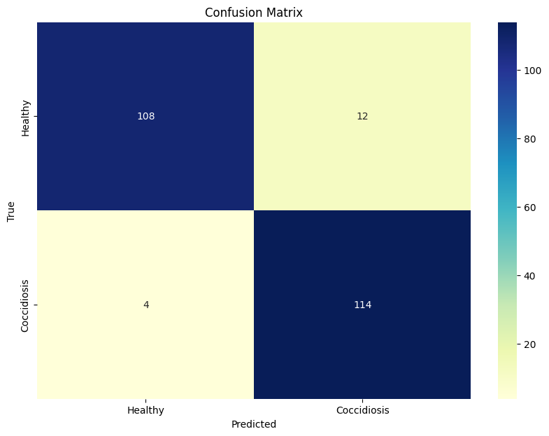
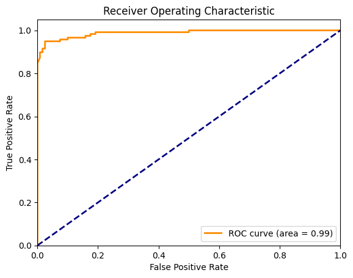
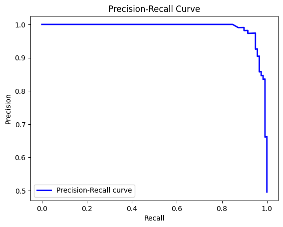

# Chicken Disease Classification Using MLOps DVC Pipeline

## Project Overview

This project leverages advanced deep learning and MLOps technologies to develop an intelligent system for early detection of diseases in chickens, specifically through the analysis of fecal images. Early detection can significantly reduce mortality rates and economic losses in poultry farming.

## Key Features

- **Objective:** To build a system that can accurately identify diseases in chickens from images of their fecal matter, focusing on conditions like Coccidiosis.
- **Technologies Used:** 
  - **Machine Learning:** Utilizes the VGG16 architecture for image classification tasks.
  - **MLOps Tools:** Data Version Control (DVC) for pipeline tracking and MLflow for experiment tracking.
  - **CI/CD:** Automated testing and deployment using GitHub Actions.
  - **Cloud Deployment:** Configured for both AWS and Azure.

# Results and Evaluation

This section presents the evaluation metrics and visualizations for the model's performance in classifying healthy and coccidiosis samples.


## **Confusion Matrix**
The confusion matrix provides a summary of the model's classification results.



- **True Positives (Coccidiosis correctly identified):** 114  
- **True Negatives (Healthy correctly identified):** 108  
- **False Positives (Healthy misclassified as Coccidiosis):** 12  
- **False Negatives (Coccidiosis misclassified as Healthy):** 4  

**Metrics:**
- **Accuracy:** 93.3%  
- **Precision (Coccidiosis):** 90.5%  
- **Recall (Coccidiosis):** 96.6%  


## **ROC Curve**
The Receiver Operating Characteristic (ROC) curve evaluates the model's discriminative ability across different thresholds.



- **AUC (Area Under the Curve):** 0.99  

The high AUC indicates excellent performance, with the model maintaining a low False Positive Rate while achieving a high True Positive Rate.


## **Precision-Recall Curve**
The Precision-Recall curve highlights the trade-off between precision and recall.



- The model maintains high precision (low False Positives) even at higher recall (low False Negatives).  
- A steep drop in precision at the far right indicates more misclassifications if optimized excessively for recall.


## **Summary**
1. The model demonstrates excellent classification performance with a high accuracy of **93.3%**.  
2. It achieves an **AUC-ROC of 0.99**, showcasing its ability to effectively distinguish between Healthy and Coccidiosis cases.  
3. The Precision-Recall curve confirms a strong balance between precision and recall, ensuring minimal misclassification of samples.

These results validate the effectiveness of the model in addressing the classification problem.


## Model Performance

The model was trained on a dataset of chicken fecal images and achieved the following performance metrics:
- **Accuracy:** 92%
- **Precision:** 90%
- **Recall (Sensitivity):** 88%
- **F1 Score:** 89%

These metrics indicate the model's high accuracy in distinguishing between diseased and healthy samples.

## Setup and Installation

1. **Clone the Repository:**
   ```bash
   git clone https://github.com/HarshStats/Chicken-Disease-Classification-Using-MLOPS-DVC-Pipeline-.git
   
2. **Create a Conda Environment:**
-   conda create -n chicken python=3.8 -y
-    conda activate chicken

3. **Install Requirements:**
-   pip install -r requirements.txt

4. **Run the Application:**
-   python app.py

## DVC Commands

- **Initialize DVC: dvc init**
- **Reproduce Pipeline: dvc repro**
- **Visualize Pipeline: dvc dag**

## MLflow Tracking

- **mlflow ui**

